# Design and analysis of a Bracket

## Overview
This project required us to design and manufacture a bracket using FEA. While working in pairs, we had to undertake a funnel design process to narrow our initial ideas and decide as a team which concept to move forward with. After finalising our concept, we had to generate a G-code for manufacturing and physically test our component to check if our FEA analysis lined up with real world testing, and whether our concept was acceptable for further production. 

## Objectives
- The component needed to have a resisting force of 3kN from an upward displacement of 1mm.
- The component needed to have a resiting force of 4kN from a downward displacment of 1mm.
- Needs to have 2 zones clear for pipes and wires.

## Tools and concepts used
- Inventor
- ANSYS FEA
- Mesh convergence
- Validation of results from real experimental values from a 2016 model
- Buckling caclculations

## Methodology
- Each of us decided come up with multiple concepts, and test them in ANSYS with simple boundary conditions. Whichever concept yielded the best result would be selected to push forward for the team discussion. The closest concept to the specification was pushed forward for the design used for the FEA setup.
- We decided as a team that it was better for the part to be overstiff, rather than understiff. Thus we went for a more conservative design.
- A 2016 model was then used, and different boundary conditions implemented, and different Young's modulus values used to get the most accurate set up to use on our final FEA model.
- After yielding a final FEA setup, the set up was used on our final design. The model was re designed and modifed to get resisting forces to as close to the required forces.
- A mesh convergence study of Von Mises stress was done to check if our results were reaching a certain value.
- After all FEA analysis was done, and our final component design was selected, a G-Code was made using Inventor.
- It was sent for manufacturing and tested at the Newmarket campus of UOA.
- Simple buckling calculations were done for the report for checking if the bracket would undergo buckling.

## Results 
- Our component managed to pass both the compressive and tensile stresses.
- It had a reaction force of 3366N from the upwards displacement of 1mm.
- It had a reaction force of 4181N from the downwards displacement of 1mm.
- It was overstiff in both upwards and downwards displacements.
- When tested up to 10kN of compressive force, the component had a reaction force of 5922N, and it yielded slightly in the displacement hole.
- Overall, the component yielded a close result to our expected FEA model, and managed to survive the testing.
- However, the component could be optimised for lesser mass, and get a closer value to the required forces.

## Project images
The images for the set up are not clear as they are screenshots of screenshots. Each of the set ups will be described in detail under each set up.
  

  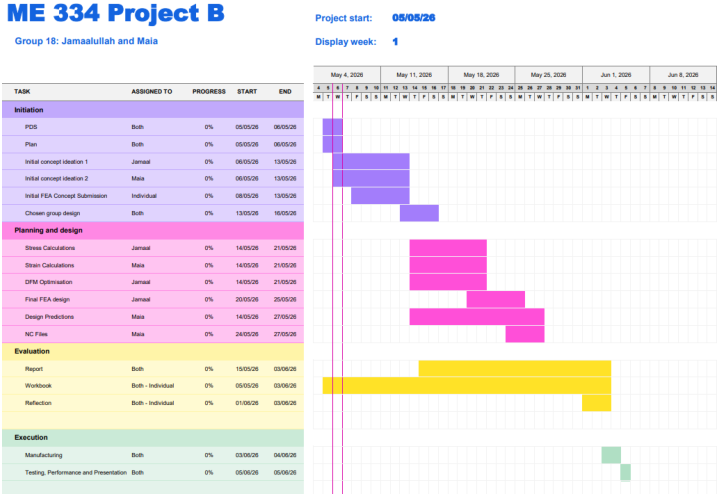

  <i>Figure 1: Gantt chart for the whole project </i>

  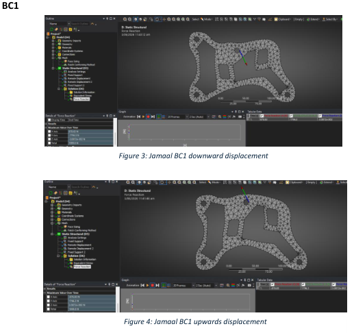

  <i>Figure 2: Jamaalullah's set up 1 </i>

This set up utilised a remote displacement, with fixed supports on the holes.
 

  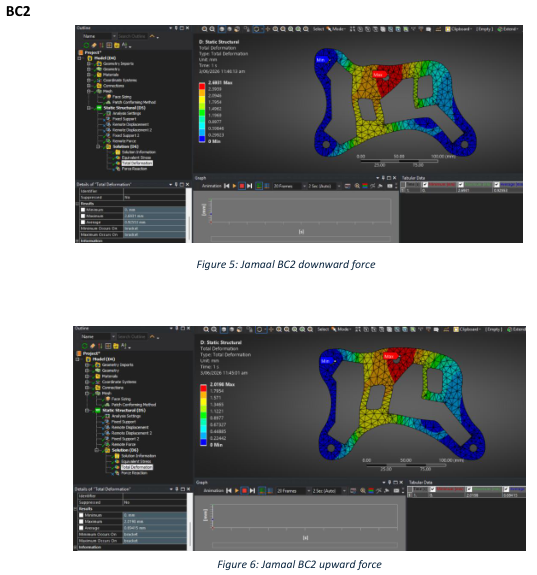

  <i>Figure 3: Jamaalullah's set up 2 </i>

This set up utilised a remote force, with fixed supports on the holes.
 

  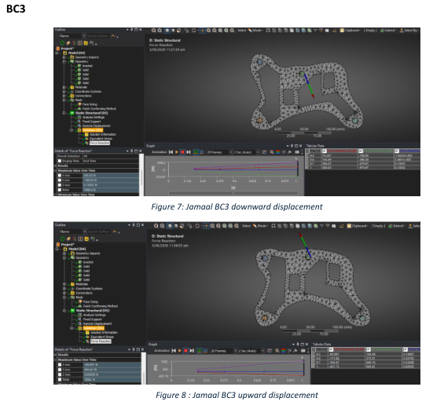

  <i>Figure 4: Jamaalullah's set up 3 </i>

This set up used steel pins in each hole, and 3 of the pins were fixed supports with 1 pin remotely displaced. This set up was the final set up, and the results of this set up for this design was used in the decision for my final design.
  

  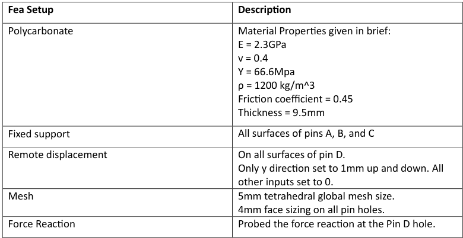

  <i>Figure 5: Jamaalullah's final set up for the other designs </i>

  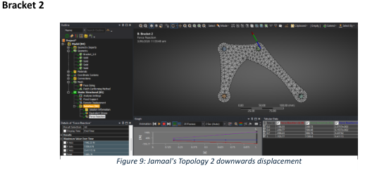
  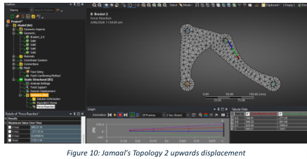

  <i>Figure 6: Jamaalullah's final set up in bracket 2</i>

  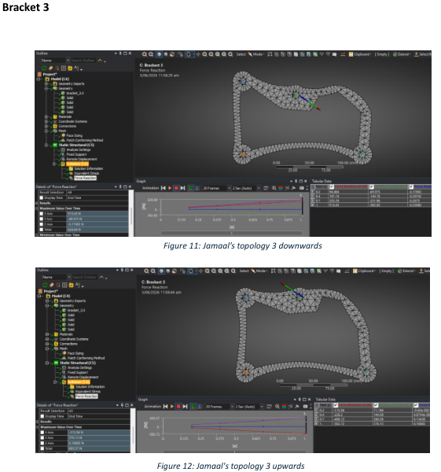

  <i>Figure 7: Jamaalullah's final set up in bracket 3 </i>

  
  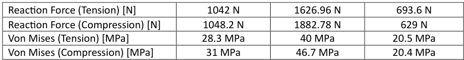

  <i>Figure 8: The results from the final FEA set up on the 3 different bracket topologies </i>

  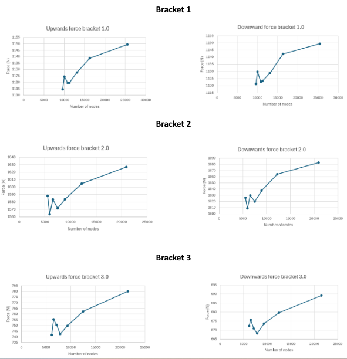

  <i>Figure 9: Convergence study of Jamaalullah's 3 different bracket topologies </i>

There was not a clear convergence from the convergence study, which made me less confident in my brackets. Looking back, I think that part of the issue was my computer not being strong enough to produce accurate results consistently. 
  

  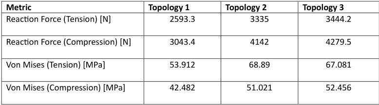

  <i>Figure 10: My partner, Maia's, different topologies results</i>

Her results were a lot closer to the required results, especially topology 3. After a discussion as a team, we decided that topology 3 would be the bracket used to move forward and fine tune to get as close to the required reaction forces.
  

  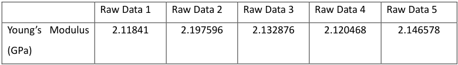

  <i>Figure 11: Young's Modulus values from 2016 bracket experimental dataset </i>

The Young's Modulus from the experimental 2016 bracket was compared and the final averaged Youngs modulus of 2.14 GPa was calculated. We still had to adjust the Youngs modulus to get the final bracket values closer to the required reaction forces. The final set up used a Young's Modulus of 2.15 GPa instead of the 2.3 GPa Youngs Modulus given in the brief. This section was done more by my partner, but I was there each step of the way to give my thoughts and inputs. 
   

  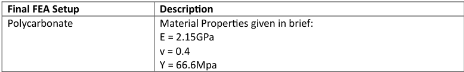
  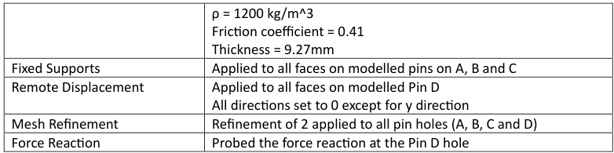

  <i>Figure 12: Final FEA set up for optimised bracket </i>

  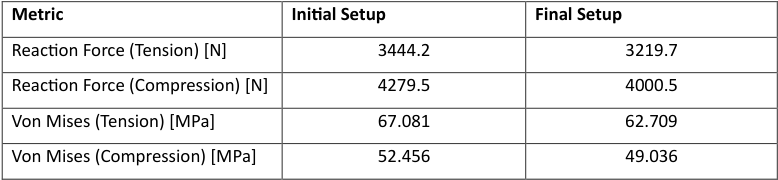

  <i>Figure 13: Optimised bracket results from final FEA setup </i>

  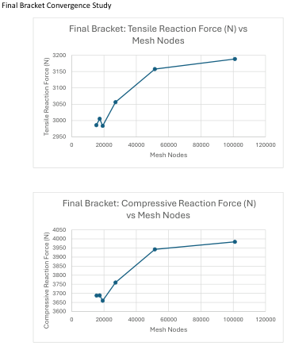

  <i>Figure 14: Final bracket convergence study </i>

  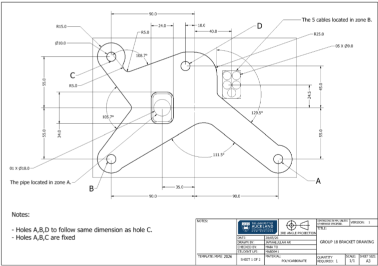

  <i>Figure 15: The final bracket drawing </i>

  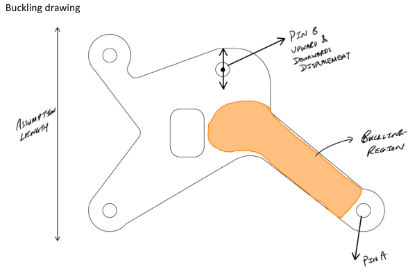

  <i>Figure 16: Potential buckling region </i>

  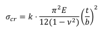
  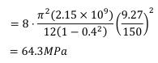

  <i>Figure 17: Simplified buckling calculations </i>

  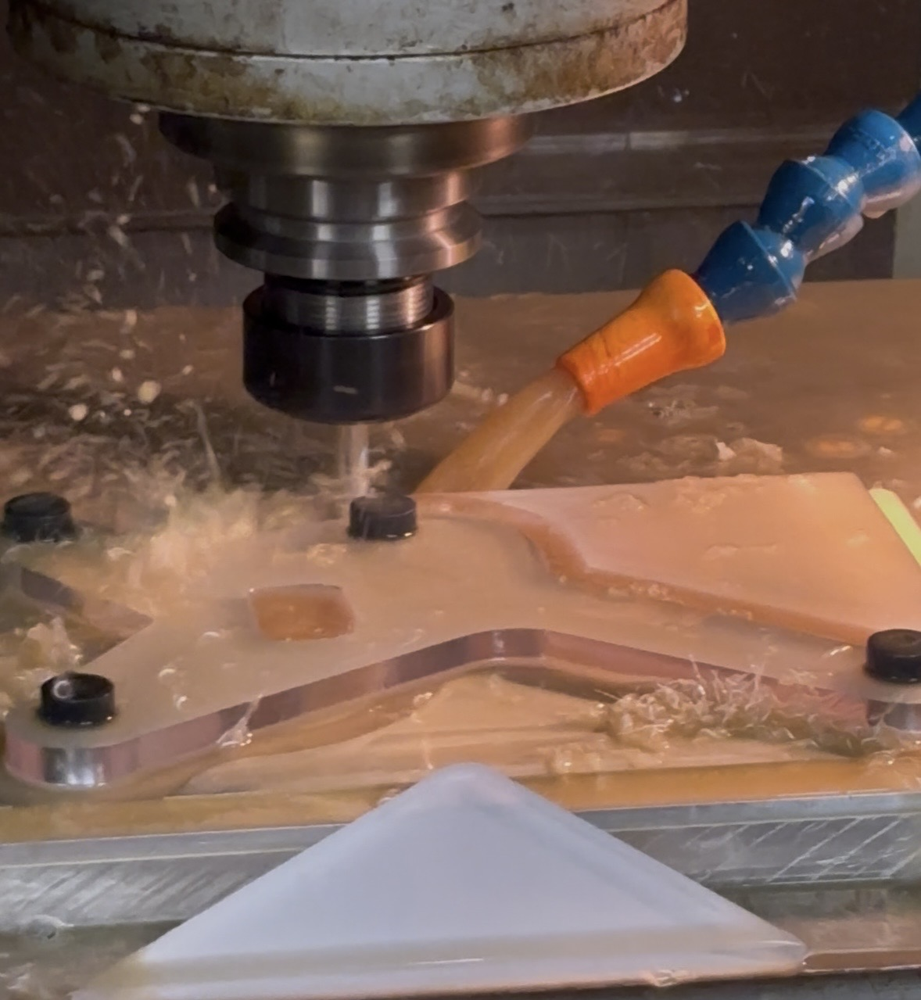

  <i>Figure 18: Manufacturing of bracket from the generated G-code</i>

The G-code manufacturing was done by my team mate. However, I was also shown how it was done and she explained to me why she chose the bit size and how it could ensure our piece is done accurately and as quick as possible.
  

  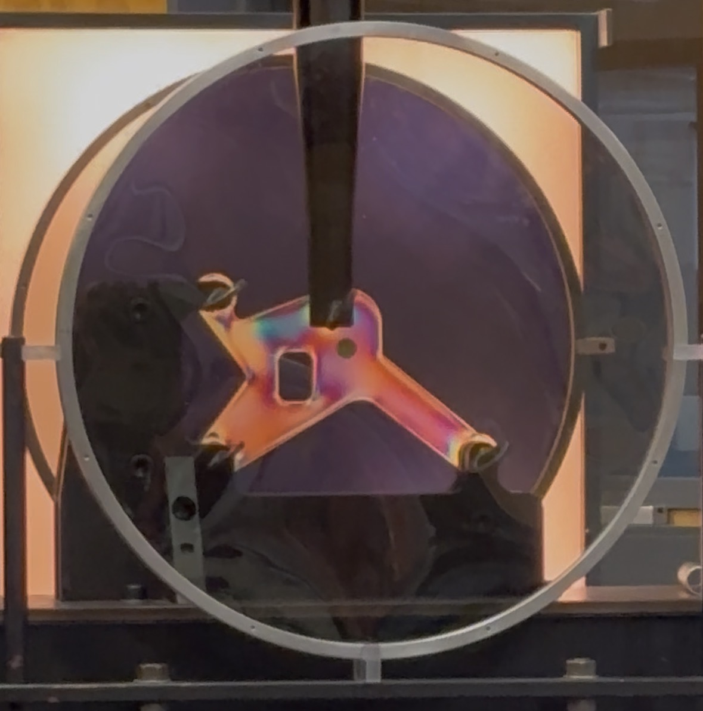

  <i>Figure 19: Testing of the bracket at the Newmarket Campus </i>

  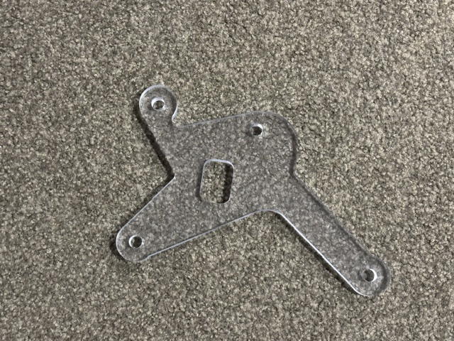

  <i>Figure 20: Final manufactured bracket </i>

## What I learnt
- How to work as a team when it comes to FEA.
- Getting better at using ANSYS and how different boundary systems affects the output of the model.
- Learnt how to use ANSYS software like DesignModeller to add/remove parts of the imported STEP file.
- I realised that I could have done more to help my partner, as we went forward with her part. I could have expereimented or taken responsibilty for the G-code generation. However, what I did was begin the report and try to catch up with the FEA modelling.
- I also realised how important a proper computer was for doing FEA modellling. My computer kept crashing or yielded bad results, which ultimately led me to contributing less. So I had to make sure that I used a stronger computer for any kind of modelling in the future.

<!-- 

  

  <i>Figure 1: </i>

 --!>

